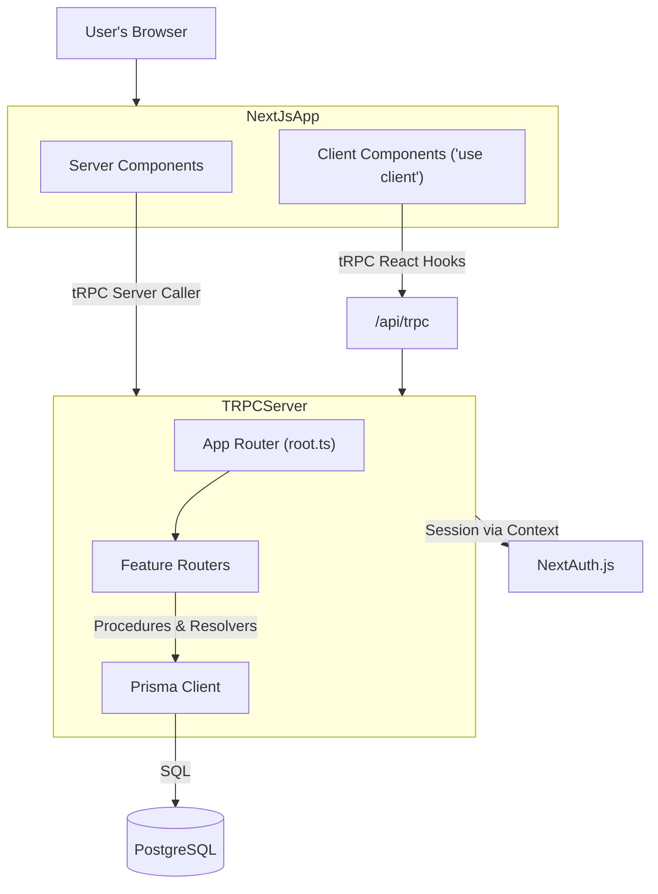

# Technical Design Proposal: SaaS App Core Patterns & Boilerplate

## 1. Introduction

This Technical Design Proposal (TDP) outlines the high-level technical solution for the SaaS App Core Patterns & Boilerplate, as defined in the Product Requirements Document (PRD). The goal is to provide a robust, extensible, and best-practice-aligned foundation for modern SaaS web applications, leveraging the T3 stack: Next.js App Router, tRPC, Prisma, NextAuth.js, Tailwind CSS, and ShadCN/UI. This TDP serves as the blueprint for implementation and future extension.

---

## 2. Proposed Technical Solution

### 2.1 High-Level Description
- The boilerplate will be structured around the Next.js App Router, with clear separation between Server and Client Components.
- All business logic will be encapsulated in a service layer, decoupled from API handlers (tRPC procedures).
- Authentication and user management will use NextAuth.js with Prisma Adapter.
- UI will be built with Tailwind CSS and ShadCN/UI components, ensuring accessibility and responsiveness.
- API endpoints will be implemented using tRPC, with feature-based routers and Zod for input validation.
- Data fetching will leverage React Query (via tRPC) for client-side state and caching.

### 2.2 Component Strategy (Server vs. Client)
- **Server Components**: Default for all pages and layouts, responsible for data fetching and passing props to Client Components.
- **Client Components**: Used for interactivity (forms, modals, notifications, onboarding wizard, etc.).
- **ShadCN/UI**: All UI elements should use ShadCN/UI components from `app/srccomponents/ui/` unless a strong justification for custom components exists.
- **Key UI Components**:
  - Layouts: `layout.tsx` (public, authenticated)
  - Auth pages: `page.tsx` under `app/(auth)/`
  - Profile: `UserProfileCard.tsx`, `UserProfileForm.tsx`
  - Modals/Dialogs: `Dialog.tsx` (ShadCN/UI)
  - Notifications: `Toaster.tsx` (ShadCN/UI)

### 2.3 Architectural Changes
- Introduce a `services/` directory under `app/srcserver/` for business logic.
- Expand `app/srccomponents/ui/` with required ShadCN/UI components.
- Add onboarding and help components as optional features.
- Integrate file upload handling (profile pictures, documents) with secure validation.
- Update Prisma schema as needed for new features (see below).

#### Mermaid Diagram (High-Level)

### 2.4 Data Model Changes (Prisma)
- **User**: Already present. Extend as needed for profile fields (e.g., onboarding status, profile picture URL).
- **File Uploads**: Add a `File` model if supporting document uploads.
- **Onboarding/Help**: Add models if persistent onboarding/help state is required.

### 2.5 API Design (tRPC)
- Organize routers by feature (e.g., `userRouter`, `fileRouter`, `onboardingRouter`).
- Use `publicProcedure` for unauthenticated endpoints, `protectedProcedure` for authenticated ones.
- Input validation with Zod schemas (centralized in `app/srclib/schemas/` if complex).
- Service layer functions called from tRPC procedures.
- Standardized error handling and responses.
- Pagination, filtering, and sorting for list endpoints.

### 2.6 Data Fetching Strategy
- **Server Components**: Use tRPC server-side caller for data fetching.
- **Client Components**: Use tRPC React Query hooks for queries/mutations.
- **Initial Data**: Pass as props from Server to Client Components where possible.

### 2.7 Caching Strategy (Data Layer)
- Use React Query for client-side caching and background refetching.
- Leverage Next.js App Router's built-in caching for Server Components where appropriate.
- Consider SWR for static data if needed.

### 2.8 State Management
- Local state via React (`useState`, `useReducer`) in Client Components.
- Server state via React Query (tRPC integration).
- Avoid global state libraries unless justified by complexity.

### 2.9 Forms and Mutations
- Use ShadCN/UI form components.
- Client-side forms submit via tRPC mutations.
- Input validation with Zod.
- Consider Server Actions for forms that require server-side logic.

### 2.10 Loading UI and Error Handling
- Use `loading.tsx` and `error.tsx` in each route segment as per Next.js best practices.
- Display user-friendly error messages and loading indicators (ShadCN/UI components).

### 2.11 Key Algorithms or Logic Flows
- Authentication/session management (NextAuth.js + Prisma Adapter).
- File upload validation and storage.
- Pagination/filtering logic in tRPC procedures.

---

## 3. Impact on Existing System
- Extends the current architecture with new feature routers, service layer, and UI components.
- May require updates to the Prisma schema and migrations.
- Adds new pages and components under `app/srcapp/` and `app/srccomponents/ui/`.
- No breaking changes to existing features anticipated if best practices are followed.

---

## 4. Technology & Patterns
- Strict adherence to the T3 stack and all referenced best practices.
- All UI components should use ShadCN/UI unless otherwise justified.
- All API and data access must use tRPC and Prisma, with Zod for validation.
- No new core technologies or patterns are proposed at this time.

---

## 5. Integration Points
- NextAuth.js for authentication/session management.
- tRPC for API endpoints and data fetching.
- Prisma for all database access.
- ShadCN/UI for all UI elements.
- React Query for client-side data/state management.

---

## 6. Scalability, Performance, and Security Considerations
- **Scalability**: Modular feature routers, service layer, and component structure support future growth.
- **Performance**: Server Components for data fetching, React Query for client caching, minimal client-side JS.
- **Security**: Input validation (Zod), protected tRPC procedures, secure file upload handling, environment variable management, and adherence to NextAuth.js best practices.

---

## 7. Out of Scope / Future Considerations
- Role-based access control (RBAC)
- User invites
- Audit logs
- Rate limiting/throttling
- Billing/subscription management
- Security/compliance (GDPR, secure headers, etc.)
- Email sending
- Logging/monitoring

---

## 8. Open Questions / Points for Discussion
- Should onboarding/help be included in the MVP or deferred?
- Preferred file storage solution for uploads (local, S3, etc.)?
- Any custom UI components anticipated beyond ShadCN/UI?
- Should optimistic updates be implemented for all mutations or only select features?

---

**This TDP is ready for review. Please provide feedback or guidance on open questions and any additional requirements.** 